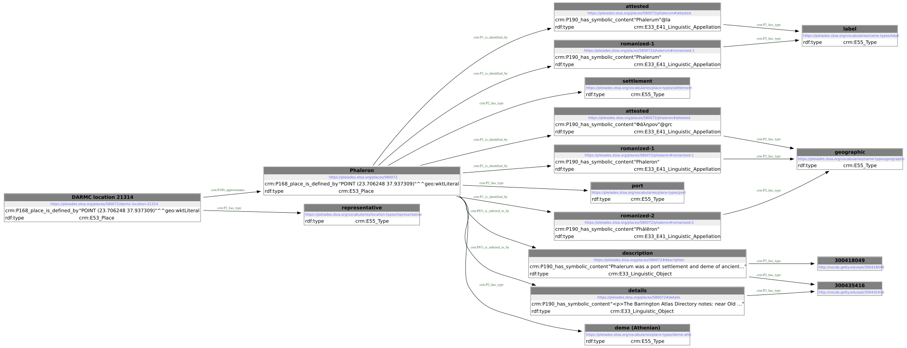
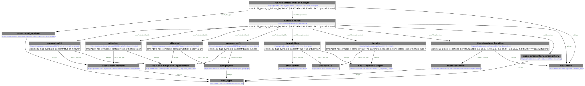
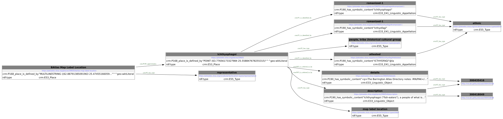
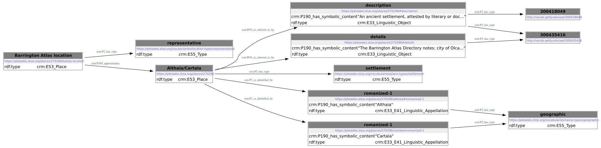

# Examples

Four Pleiades places as they appear in `pleiades-places.nt`, chosen to show a range of the modelling choices described in the [main README](../README.md#model). Each file holds every triple about the place, its names, its statements and its locations, plus the vocabulary terms they use.

| File | Place | What it shows |
|---|---|---|
| [`phaleron.ttl`](phaleron.ttl) ([diagram](phaleron.svg?raw=true)) | [Phaleron](https://pleiades.stoa.org/places/580072) | A settlement with one precise point location, which `P189_approximates` the place. Several place types. Names attested in Greek (`@grc`) and Latin (`@la`), with the romanized forms "Phaleron, Phálēron" split into two untagged appellations. Name types `geographic` and `label`. |
| [`epidion-akron.ttl`](epidion-akron.ttl) ([diagram](epidion-akron.svg?raw=true)) | [Epidion Akron](https://pleiades.stoa.org/places/89178) | A rough location: the place `P89_falls_within` a one-degree polygon. A second, precise location of type `associated_modern` (the Mull of Kintyre, from OpenStreetMap) `P189_approximates` the place. |
| [`ichthyophagoi.ttl`](ichthyophagoi.ttl) ([diagram](ichthyophagoi.svg?raw=true)) | [Ichthyophagoi](https://pleiades.stoa.org/places/29605) | A people rather than a settlement. Its only location is a Barrington Atlas map label, a `MULTILINESTRING` that is precise as a geometry but says little about where the people lived. Name type `ethnic`, including a romanized name with no attested form. |
| [`althaia-cartala.ttl`](althaia-cartala.ttl) ([diagram](althaia-cartala.svg?raw=true)) | [Althaia/Cartala](https://pleiades.stoa.org/places/270296) | An unlocated place: no representative point, and its one location has no geometry but still `P189_approximates` the place. Romanized names only. |

All four have a description (typed as brief text, `aat:300418049`) and details, each a `crm:E33_Linguistic_Object` linked with `P67i_is_referred_to_by`.

## Diagrams

Each example has a diagram of its graph, drawn by RDFLib's `rdf2dot` and Graphviz. To keep the diagrams readable, [`scripts/diagram.py`](../scripts/diagram.py) shortens literals to 50 characters and lists each resource's types in its box instead of drawing them as edges. The Turtle files have the full data. Click a diagram to see it full size.

### Phaleron

[](phaleron.svg?raw=true)

### Epidion Akron

[](epidion-akron.svg?raw=true)

### Ichthyophagoi

[](ichthyophagoi.svg?raw=true)

### Althaia/Cartala

[](althaia-cartala.svg?raw=true)

## Regenerating

```sh
make examples
```

This builds `pleiades-places.nt` if needed, then extracts and formats each example with `riot` and draws its diagram. `make diagrams` redraws only the diagrams, though it too rebuilds the examples first if `pleiades-places.nt` is newer or missing. The places and their IDs are listed in the [Makefile](../Makefile). The output follows the latest Pleiades data, so the files can change when the data does.
